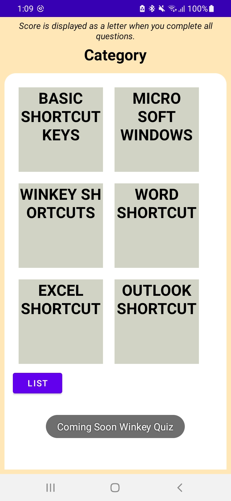

# Quiz App

Task-3 Quiz App 

MyShortcutKeysQuiz is an Android quiz app that helps users learn and test their knowledge of Windows computer shortcut keys. This app is developed in Java using Android Studio.

Given by: Bharat Intern

## Features

- Quiz on Windows computer shortcut keys.
- Multiple-choice questions.
- User-friendly interface.

## Video Demo

Watch a video demonstration of the Quiz App.

## Screenshots

